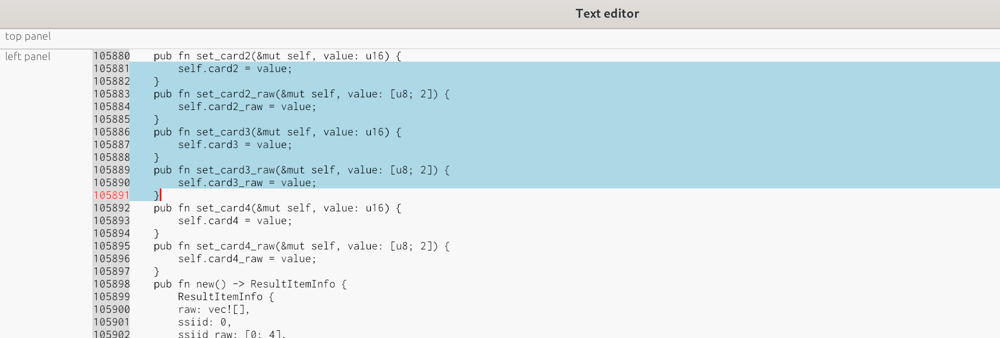

A text editor component for [egui](https://github.com/emilk/egui).

Currently, work in progress. Very early stage.

# What has been done?
- Virtual scroll
- cursor with click
- cursor with arrow
- cursor movement auto scroll panel
- text selection
- line number

# Screenshot

- Opened file is: 3.1mb
- Frame update takes: ~100microseconds
- Empty egui app is ~12mb
- Egui app with text-editor component: ~20mb